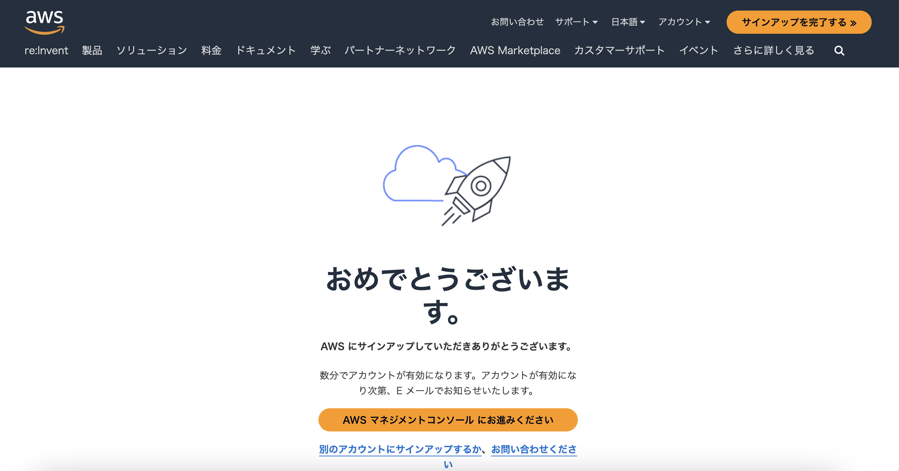
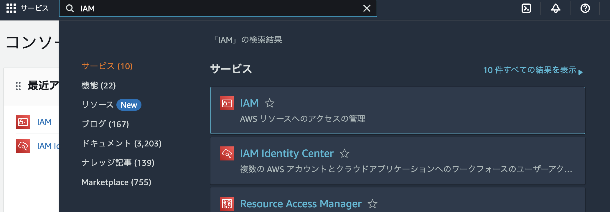
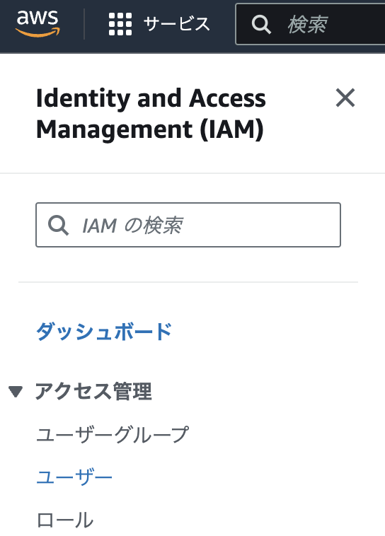
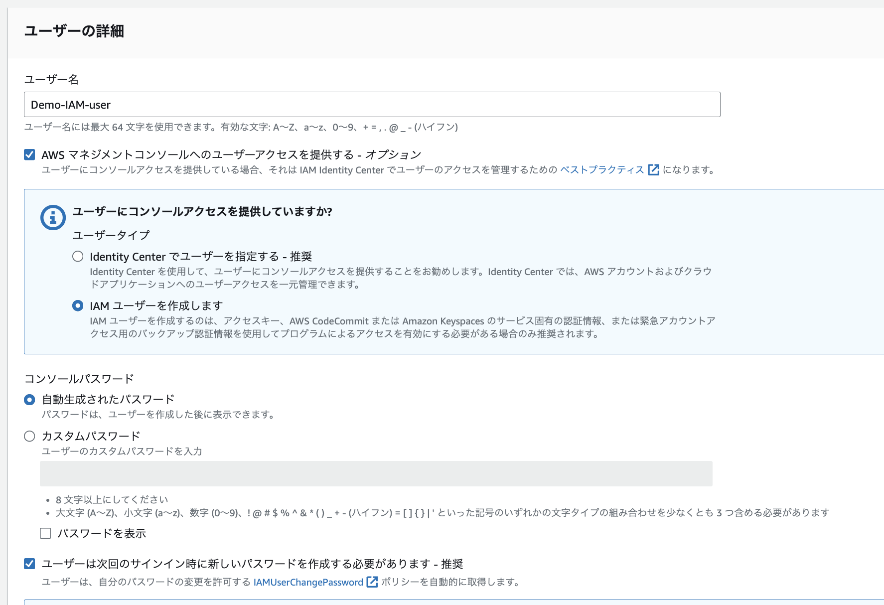
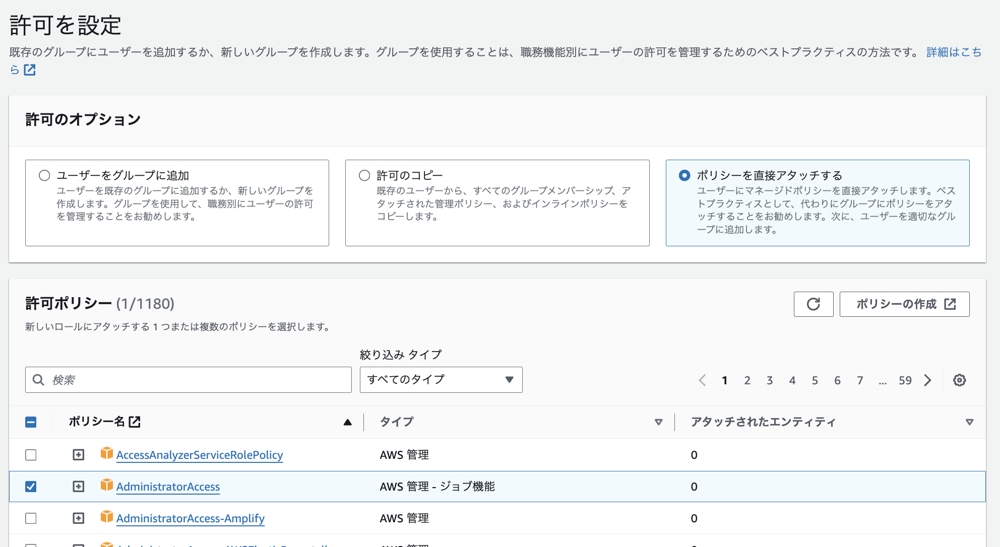
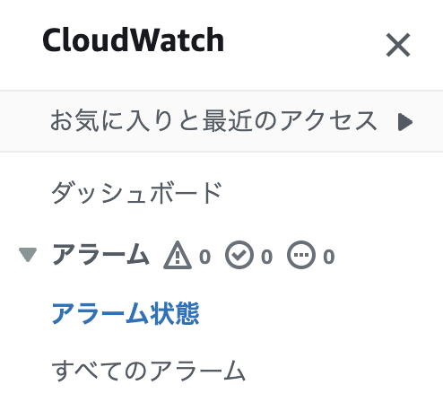

# AWS cloud9登録方法
PHPを動かしたいとき、これまで「XAMPP」を使っていました。
しかし「AWS Cloud9」を使うとより便利だと知り、登録に挑戦します！

## 登録までの流れ
Amazonが丁寧に[「登録までの流れ」](https://aws.amazon.com/jp/register-flow/)を解説しています。
ここは個人情報を入力するだけなので、簡単でした。
クレジットカードの用意をしておくとスムーズです。
設定したIDをパスワードを使って「ルートユーザー」でログインしましょう！

## AWSアカウントのセキュリティを強化させよう
AWSアカウントは、そのままだとセキュリティ的にあまりよろしくないので簡単なセキュリティ対策を行います。

### IAM の多要素認証 (MFA)
「ルートユーザー」でログインしたら、MFA設定をします。
ルートユーザーはなんでもできる最強の権限を持っているため、このアカウントが乗っ取られると危ないです。
そのために、MFA(多要素認証)を導入します。

先に[Google Authenticator](https://apps.apple.com/jp/app/google-authenticator/id388497605)アプリをスマートフォンにインストールして、よく使うGoogleアカウントでログインをしておきます。

AWSのマイページ上部の右に、自分のアカウント名が表示されているのでクリックします。
メニュー内に「セキュリティ認証情報」があるので、クリックして警告が出ている「MFAを割り当てる」を選択しましょう。

MFAデバイス名の登録（root_iPhone_namae）のように、ルートユーザーのデバイスであることがわかるように名前をつけるとベストです！
MFAデバイスは「認証アプリケーション」を選択し、次へボタンを押します。

先ほどダウンロードしたGoogle Authenticatorアプリをスマートフォンで立ち上げて、AWSのQRコードを表示させます。
QRコードを読み込むと、Google Authenticatorアプリに6桁の数字が現れるので入力を済ませましょう。
数十秒経過すると、ふたつめの6桁の数字が現れます、こちらも入力し完了です！

再度自分のセキュリティ認証情報を確認すると、先ほど追加したデバイスが表示されています。
これでMFA設定は完了です。

## 普段使い用のIAMユーザー作成
先ほどまで作業していたルートユーザーは、最強の権限の持ち主です。
普段使いには向かないため、もっと権限の少ない「日常用ユーザー」を作成しましょう。
こちらはルートユーザーの対となっており、アイアムユーザーと呼ばれています。

マイページ上部の検索窓に「IAM」と入力し、赤いマークのIAMをクリックします。

画面左側、アクセス管理＞ユーザーをクリックします。

オレンジ色の「ユーザーを作成」ボタンを押して、ユーザーを作りましょう！
名前をつけて、パスワードを自動生成にします。

許可のオプションは「ポリシーを直接アタッチする」を選択、ポリシー名は「AdministratorAccess」にチェックをつけます。

ユーザーを作成すると、パスワードが自動生成されます。コピーしておくか、CSVをダウンロードしておきましょう！

## お金の使いすぎ防止！請求アラート設定
AWSを無料または少額で使いたい場合、ある一定の金額を超えたらメールが来るように設定ができます。
*請求アラームを作成する前に、リージョンを米国東部 (バージニア北部) に設定する必要があります*

[公式：AWS の予想請求額をモニタリングする請求アラームの作成 - Amazon CloudWatch](https://docs.aws.amazon.com/ja_jp/AmazonCloudWatch/latest/monitoring/monitor_estimated_charges_with_cloudwatch.html)

画面左側のダッシュボード＞アラーム状態を選択し、オレンジ色の「アラームの作成」ボタンを押します。

記事執筆途中です。